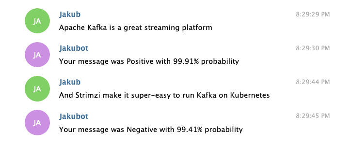

# Demo: Apache Kafka, Strimzi, Telegram and Machine Learning

This demo includes several Apache Kafka components running on Kubernetes and orchestrated by Strimzi:
* Apache Kafka Connect with the [Apache Camel Telegram source connector](https://camel.apache.org/camel-kafka-connector/latest/) is used to load messages from the [Telegram IM service](https://telegram.org/)
* The messages are transformed by a [simple Kafka Streams API application](./telegram-transformer/) where the message text and chat id are extracted from the original Telegram message
* The transformed messages are passed to [another Kafka Streams application](./sentiment-analysis/) which uses [Deep Java Library](https://djl.ai/) to do a sentiment analysis of the text and prepare an answer with the analysis results
* The answer is send back to Telegram using Apache Camel Telegram sink connector


## Prerequisites

* Create a Telegram account and register a Bot.
Botfather will give you API key for this bot

* Prepare properties file with the Telegram Bot token which will look something like this (you have to use your real Telegram token 😉):
```properties
token=123456789:ABCDEFGHIJKLMNOPQRSTUVWXYZ_09876543210
```

* Use the properties file with the Telegram token to create a Kubernetes secret names `telegram-token`
```yaml
apiVersion: v1
kind: Secret
metadata:
  name: telegram-credentials
type: Opaque
data:
  telegram-credentials.properties: dG9rZW49MTIzNDU2Nzg5OkFCQ0RFRkdISUpLTE1OT1BRUlNUVVZXWFlaXzA5ODc2NTQzMjEw
```

## Installation

### Install the Strimzi operator

* Create namespace `myproject` on your Kubernetes cluster

* Install Strimzi:
```
kubectl apply -f https://strimzi.io/install/latest
```

### Deploy the Kafka cluster

* Create the Kafka cluster
```
kubectl apply -f 01-kafka.yaml
```

* Wait for it to become ready
```
kubectl wait kafka/my-cluster --for=condition=Ready --timeout=300s
```

### Deploy Kafka Connect

* Check the [`./connect-docker-image` directory] with the sources for the custom Connect image containing the Telegram source and sink connectors from Apache Camel Kafka Connectors.

* Create the Kafka Connect cluster. Check the YAML how it creates the users, topics etc.
```
kubectl apply -f 02-kafka-connect.yaml
```

* Wait for it to become ready
```
kubectl wait kafka-connect/my-cluster --for=condition=Ready --timeout=300s
```

### Deploy the Source and Sink connectors

* Create the Telegram sink and source connectors
```
kubectl apply -f 03-telegram-source.yaml
kubectl apply -f 04-telegram-sink.yaml
```

* You can check the status of the connectors to double-check they deployed fine.

### Deploy the Kafka Streams API applications

* Deploy the Streams API app doing the transformation:
```
kubectl apply -f 05-telegram-transformer.yaml
```

* And the Streams API app doing the sentiment analysis:
```
kubectl apply -f 06-sentiment-analysis.yaml
```

### Check the result

Once everything is running, you can check the result. On Telegram, send message to your bot and wait for the answer. You should see something like this.

