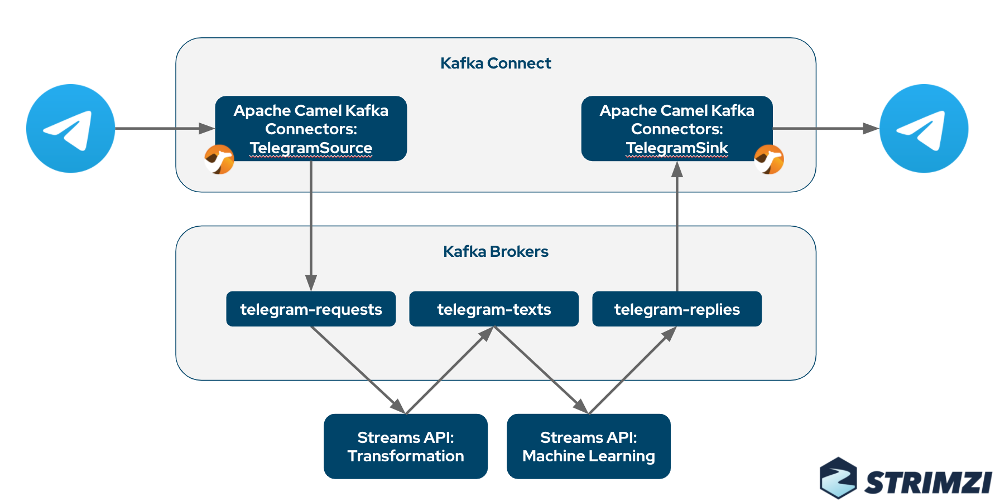

# Demo: Apache Kafka, Strimzi, Telegram and Machine Learning

This demo includes several Apache Kafka components running on Kubernetes and orchestrated by Strimzi:
* Apache Kafka Connect with the [Apache Camel Telegram source connector](https://camel.apache.org/camel-kafka-connector/latest/) is used to load messages from the [Telegram IM service](https://telegram.org/)
* The messages are transformed by a [simple Kafka Streams API application](./telegram-transformer/) where the message text and chat id are extracted from the original Telegram message
* The transformed messages are passed to [another Kafka Streams application](./sentiment-analysis/) which uses [Deep Java Library](https://djl.ai/) to do a sentiment analysis of the text and prepare an answer with the analysis results
* The answer is send back to Telegram using Apache Camel Telegram sink connector

## Prerequisites

## Installation